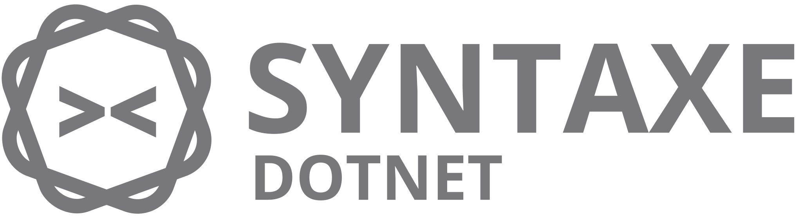

 
Syntaxe for Dotnet applications
 
 

 

_Syntaxe is a declarative data querying library inspired by graphql._

[PLEASE REFER TO THE ORIGINAL SYNTAXE DOCUMENTATION FOR A MORE DETAILED COVERAGE OF THE SYNTAXE SCHEMA AND ITS OPERATORS.](https://github.com/SyntaxeQL/syntaxe/blob/master/README.md)

Syntaxe Dotnet is based on the original syntaxe engine to support declarative data fetching and querying when building dotnet applications.

### PLEASE NOTE THAT THIS PROJECT IS STILL IN ACTIVE DEVELOPMENT AND SHOULD NOT BE CONSIDERED AS THE FINAL PROJECT